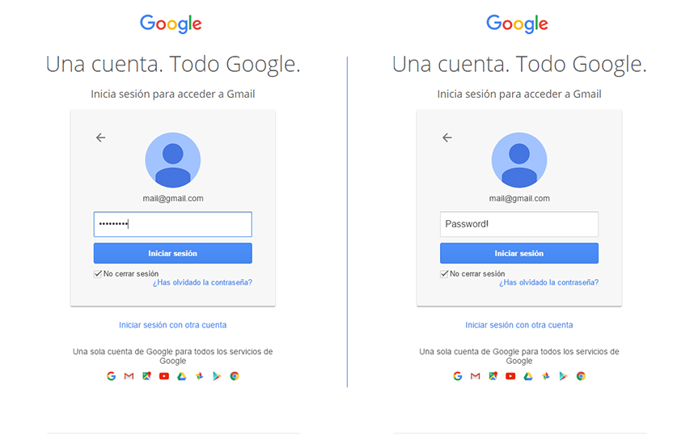

# showDottedPasswords
Bookmarklet that let you see the passwords entered in web forms. It works with passwords the browser remembers but you dont. :wink:



#### Bookmarklet
Add the bookmarklet by selecting and dragging it to your bookmarks bar. Then go to the page that shows the dotted password and click the bookmark to show it.

```javascript
javascript:!function(){for(var nodeList=document.getElementsByTagName("input"),iterator=0,node=null;node=nodeList[iterator++];)"password"==node.getAttribute("type")&&node.setAttribute("type","text");}();
```